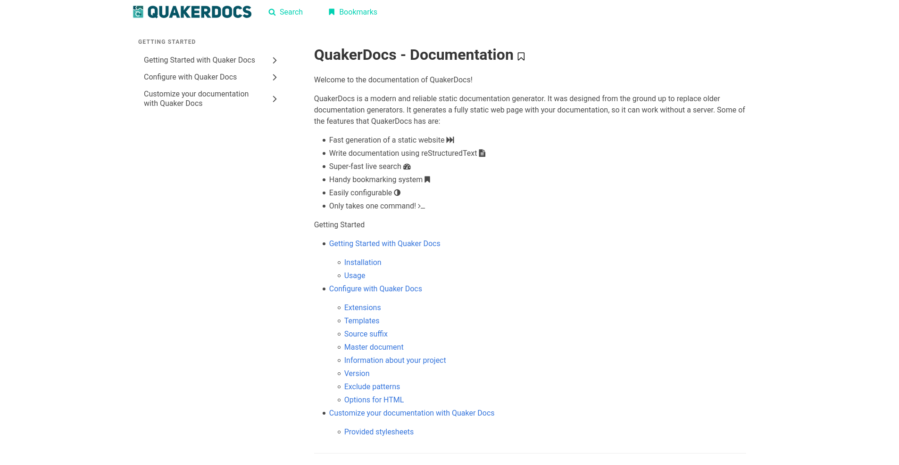
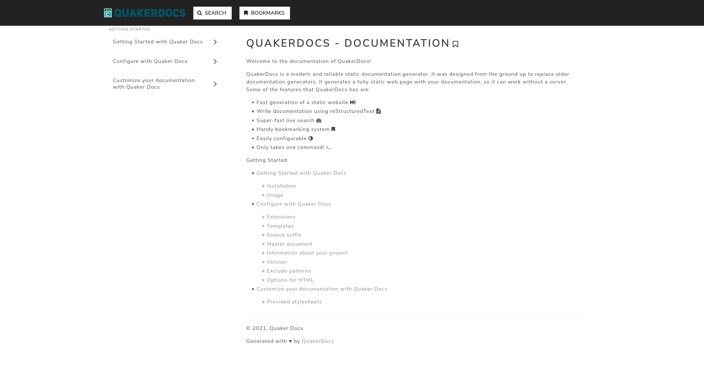
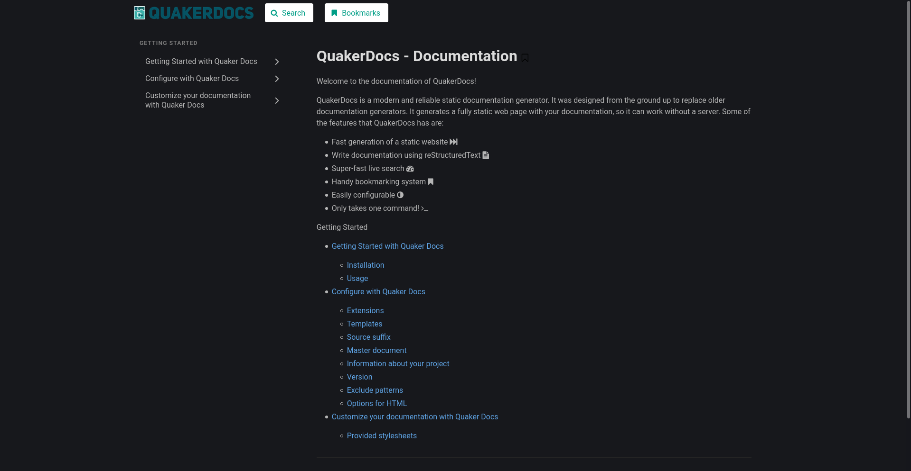
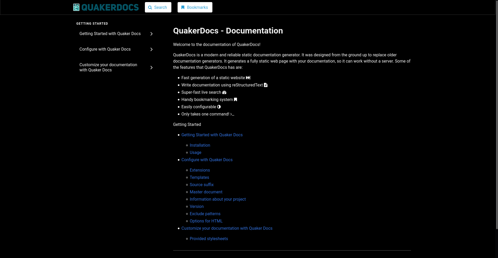
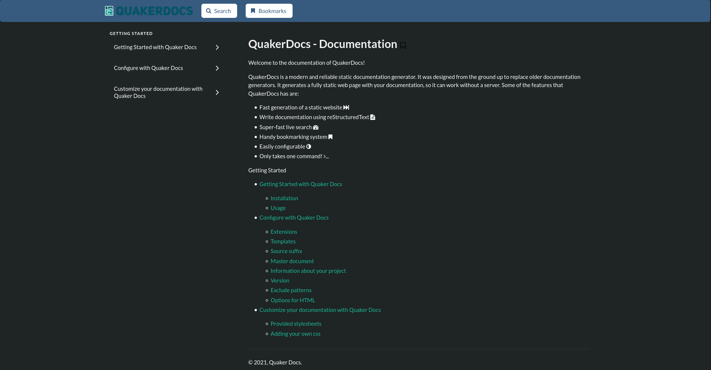
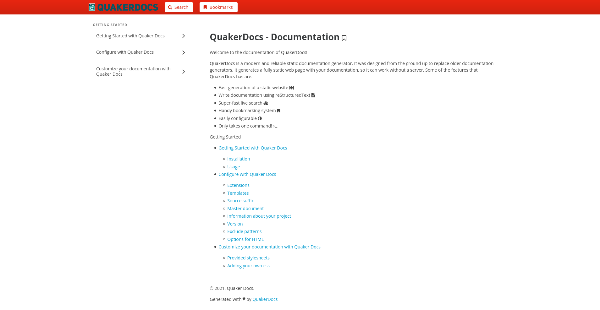

Customize your documentation with Quaker Docs
=============================================

QuakerDocs supports customizing your own documentation build with a
configuration file. This file is named `conf.py` and is found in the
/docs directory.

Provided stylesheets
--------------------

We provide you with the following 6 stylesheets which are bulma.io
compatible. Thanks to <https://jenil.github.io/bulmaswatch/> for the
provided stylesheets.

### Bulma.min

``` {code-block} python
html_style = 'css/bulma.min.css'
```



### Bulma.min-classy

``` {code-block} python
html_style = 'css/bulma.min-classy.css'
```



### Bulma.min-dark

``` {code-block} python
html_style = 'css/bulma.min-dark.css'
```



### Bulma.min-jet

``` {code-block} python
html_style = 'css/bulma.min-jet.css'
```



### Bulma.min-night

``` {code-block} python
html_style = 'css/bulma.min-night.css'
```



### Bulma.min-red

``` {code-block} python
html_style = 'css/bulma.min-red.css'
```



Adding your own css
-------------------

You can always add more stylesheets to the already provided stylesheets
by visiting [Bulmaswatch](https://jenil.github.io/bulmaswatch/) . Just
download the style and give a shoutout to bulma afterwards on
[Twitter](https://twitter.com/) .

Add the css file to `static/css` and change the html\_style to the given
name.
